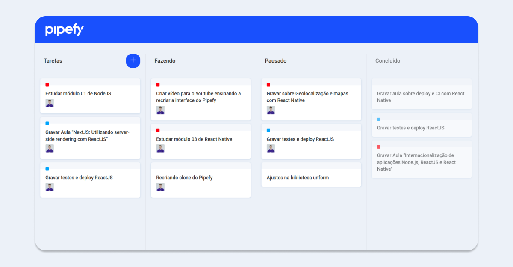

<h3 align="center">
    
</h3>

<h1 align="center">
  

  
</h1>

<h1 align="center">
    
</h1>

## :blue_book: The app

This simple <strong>[Pipefy](https://www.pipefy.com/)</strong> clone was made with the intention of gaining more knowledge about the <strong><i>Drag-and-Drop</i></strong> functionality. This feature is summarized in the act of clicking on a virtual object and dragging it to a different position or on another virtual object. In general, it can be used to invoke various types of actions, or to create various types of associations between two abstract objects. An excellent way to deliver a better user experience in various applications that can take advantage of this feature.

This application was built in this [video](https://www.youtube.com/watch?v=awRtgpRsdTQ) by [Rocketseat](https://rocketseat.com.br/).

View the [live demo](https://pipefy-ui-clone-guibsonarc.netlify.app/):

## :computer: Technologies

- [x] [React.js](https://reactjs.org/)
- [x] [React DnD](https://react-dnd.github.io/react-dnd/about)

<h1></h1>
<h4 align="center">
    Made by <a href="https://www.linkedin.com/in/guibsonarc/" target="_blank">Guibson Arcebispo</a>
</h4>